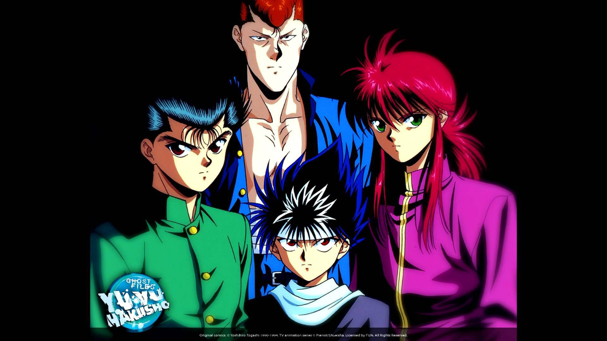
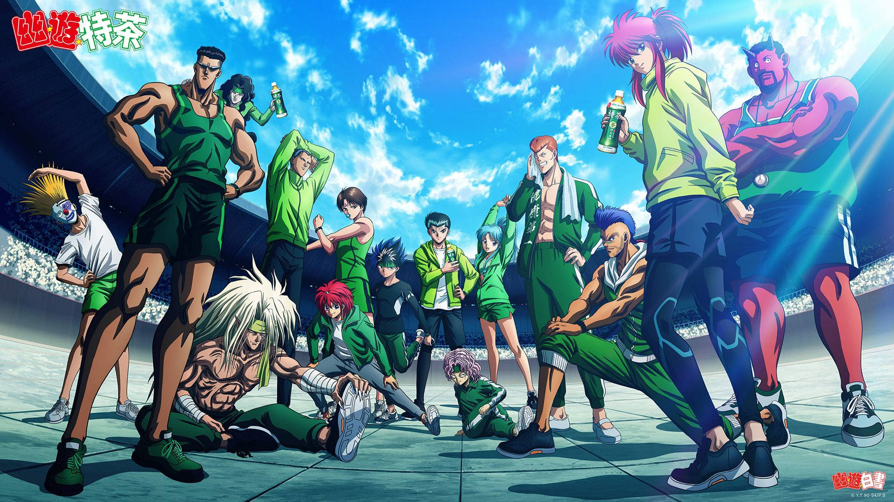
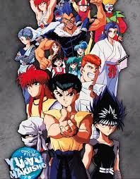
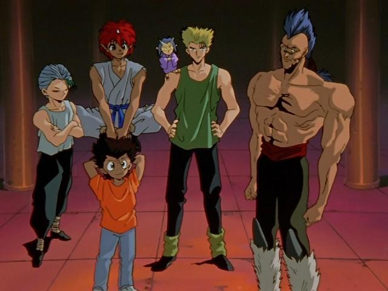
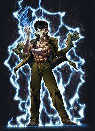
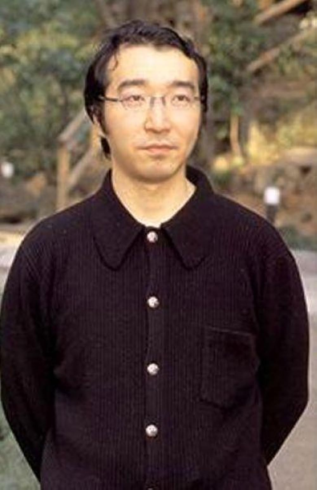

# Ghost Fighter (YuYu Hakusho)
 

## The Main Character of Ghost Fighter (YuYu Hakusho) is Yusuke Urameshi

### Description

Ghost Fighter, known as YuYu Hakusho, comprises a series of manga written and illustrated by Yoshihiro Togashi. The story sets off with the life of Yusuke Urameshi, a 14-year-old punk who dies in an accident saving the life of a little boy.

In the afterlife, Yusuke is given a chance to return to the living world by Koenma, the son of the ruler of the Spirit World. However, he must first pass a series of tests to prove his worth. After passing the tests, Yusuke becomes a "Spirit Detective," tasked with investigating supernatural occurrences and maintaining the balance between the human and spirit worlds.

Throughout the series, Yusuke and his friends face various challenges and battles against demons, ghosts, and other supernatural beings. Along the way, Yusuke learns to control his newfound spiritual powers and grows as a person.

The series is known for its blend of action, comedy, and drama, as well as its complex characters and intricate plotlines. It has been adapted into several anime series, movies, and video games, and has a large and dedicated fanbase around the world.

## The Character of Ghost Fighter (YuYu Hakusho)

### Main Characters
Yusuke Urameshi: The main protagonist of the series, Yusuke is a delinquent who becomes a Spirit Detective after his death.
Kazuma Kuwabara: A delinquent and Yusuke's rival, Kuwabara later becomes a valuable ally in Yusuke's missions.
Kurama: A powerful demon who takes the form of a human boy, Kurama is a member of Yusuke's team.
Hiei: A powerful fire demon, Hiei is a member of Yusuke's team and a formidable fighter.

### Secondary Characters
Botan: A guide in the Spirit World, Botan helps Yusuke in his missions as a Spirit Detective.
Koenma: The son of the ruler of the Spirit World, Koenma hires Yusuke as a Spirit Detective.
Genkai: A powerful martial artist and former teacher of Yusuke, Genkai becomes a mentor to Yusuke and his friends.
Keiko Yukimura: Yusuke's childhood friend and love interest, Keiko often gets involved in Yusuke's missions.
Yukina: A powerful ice demon and Kurama's love interest, Yukina is a member of Yusuke's team.
Jorge Saotome: A former enemy of Yusuke, Jorge later becomes a member of Yusuke's team.
Pu: A small, powerful creature who becomes a member of Yusuke's team.

### Allies
Humans: Atsuko Urameshi, Shizuru Kuwabara, Asato Kido, Yuu Kaito, Mitsunari Yanagisawa, Murota, Kiyoshi Mitarai, Kuroko Sato, En (M1), Ryo (M2), Ryo (M3), Kai (M3)
Demons: Rinku, Chū, Touya, Jin, Shishiwakamaru, Suzuki

### Antagonists
Special Chapter: Yatsude
Spirit Detective Saga: Gouki, Rando, Half Breed Demons, Gonzo Tarukane, Hirue
The Four Saint Beasts: Suzaku, Seiryu, Byakko, Genbu

## The All Power of Yusuke Urameshi

Yusuke Urameshi, the main protagonist of Ghost Fighter (YuYu Hakusho), has several powers throughout the series. Here are some of his notable abilities:

Spirit Gun (Reigun): Yusuke's signature move, where he fires a blast of spirit energy from his finger. He can also fire multiple shots at once or charge up a more powerful shot.
- 
Spirit Shield (Reibu): Yusuke can create a shield of spirit energy to protect himself and others.

Spirit Sword (Reiken): Yusuke can create a sword made of spirit energy, which he can use for close-range combat.
Demonic Energy: After being revealed as a demon throwback, Yusuke gains access to demonic energy, which greatly enhances his physical abilities and allows him to use new techniques, such as:
Demonic Fist: Yusuke can imbue his fist with demonic energy, increasing the power of his punches.
Demonic Illusions: Yusuke can create illusions that are difficult for his opponents to distinguish from reality.
Demonic Eye: Yusuke can use his demonic eye to see through illusions and other deceptions.
Resurrection: Yusuke has the ability to resurrect himself after being killed, thanks to his demonic powers.
Physical Enhancements: Yusuke's physical abilities, such as strength, speed, and endurance, are enhanced through his training and demonic powers.
Spirit Perception: Yusuke can sense and see spirits and other supernatural phenomena that are invisible to normal humans.
Aura Perception: Yusuke can see the aura of living beings, which can reveal information about their health, emotions, and power levels.
Demonic Transformation: Yusuke can transform into a more powerful demonic form, with horns, claws, and enhanced abilities.
Spirit Fusion: Yusuke can fuse his spirit with other beings to create a more powerful entity. He has done this with Botan, Kuwabara, and Kurama.
These are just some of Yusuke's powers in Ghost Fighter. His abilities evolve and grow throughout the series, making him a formidable and dynamic protagonist.

## The Creator of Ghost Fighter (YuYu Hakusho)

The creator of Ghost Fighter (YuYu Hakusho) is Yoshihiro Togashi. He is a Japanese manga artist who has written and illustrated several popular manga series, including Hunter x Hunter and Level E.

Ghost Fighter is one of Togashi's most successful works, and it has been adapted into several anime series, movies, and video games. The series follows the story of Yusuke Urameshi, a delinquent who becomes a Spirit Detective after his death. Along with his friends, Yusuke investigates supernatural occurrences and battles against demons, ghosts, and other supernatural beings.

Togashi's work on Ghost Fighter is notable for its blend of action, comedy, and drama, as well as its complex characters and intricate plotlines. The series has gained a large and dedicated fanbase around the world, and it has been praised for its unique take on the supernatural genre.

